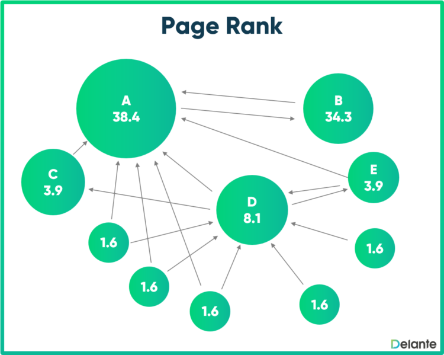
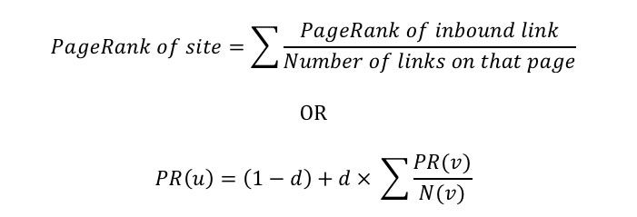

# Page rank

Page Rank is a method for rating web pages objectively, effectively measuring human interestand attention devoted to them. The page rank algortihm gives each page a rating equivalent to the page importance.



Where the Google Page rank algortihm was revolutionnary for its time is the importance of a page is measured by the importance of other pages linking to it. For example, let's take a small web network of 4 pages: A, B, C, D. Page C has a higher page rank than page D, even though there's fewer links linking to C. It's because the only page linking to C (A) is of higher quality and importance.

## Inner working

The internet is a collection of N pages, with a very big N (10 to the power of 10 in october 2005). It's possible to represent the web with an adjency matrice of size N \* N.

    A		B		C		D

A 0 0 1 0

B 1 0 1 1

C 1 0 0 1

D 0 1 1 0

In this matrice, A points towards C. So A has 1 outbounds link. We can see that B points towards A, and C points towards A as well. So A has two inbounds links.

A's inbounds links are useful, cause be can use them to count the number of pages pointing to A. A inbound link to A means a neighbor. We can calculate A's new page_rank summing up the current score if its inbounds_links divided by the number of an inbounlink's outbound link.

Like this:



How it works:

```
pages = [ "A", "B", "C", "D"]
```

1. Assign each page an initial rank of 1/N.

   ```
   initial_PageRank = [1/N, 1/N, 1/N, 1/N]
   ```

```
intial_PageRank = [ 1/4, 1/4, 1/4, 1/4]
```

2. For n iterations, calculate a new page_rank for each page of the pages array, taking into account the weight of every page that links to one page.
3. Repeat this process until the page rank stabilizes.
